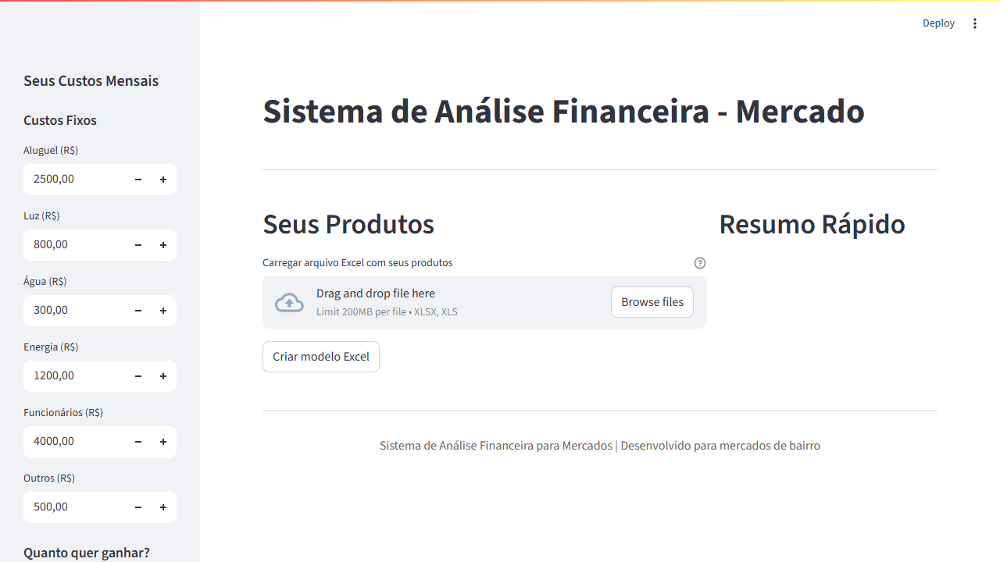
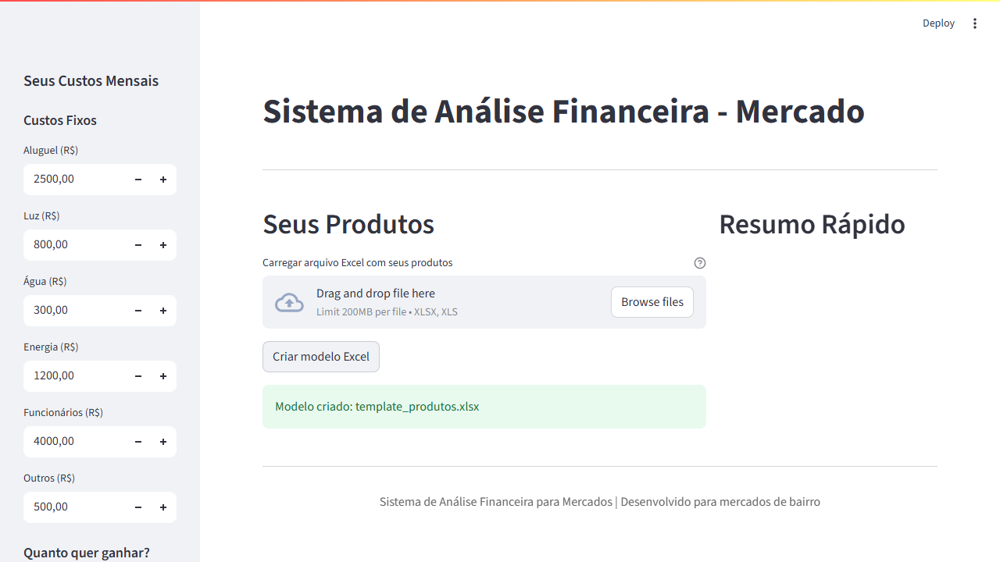
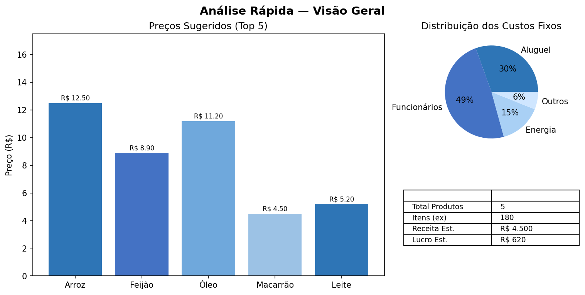

# Sistema de Análise Financeira - Mercado Autônomo

Sistema simples para ajudar donos de mercados de bairro a calcular o preço certo dos produtos, considerando todos os custos fixos (aluguel, luz, funcionários, etc.).

## Para que serve?

Ajuda você a descobrir:
- Qual preço cobrar em cada produto
- Se está ganhando dinheiro suficiente
- Como os custos fixos afetam seus preços
- Quais produtos dão mais lucro

## O que o sistema faz

### Funcionalidades principais
- **Calcula preços automaticamente** baseado nos seus custos
- **Importa produtos do Excel** - você só precisa colocar o que comprou
- **Mostra gráficos e relatórios** fáceis de entender
- **Exporta resultados** para Excel
- **Cria template** para você preencher seus produtos

### Informações que você vai ver
- Preço sugerido para cada produto
- Quanto você vai ganhar por produto
- Produtos que dão mais lucro
- Resumo geral dos seus custos e ganhos

## Como instalar

### Opção 1: Instalação automática (mais fácil)
1. **Baixe os arquivos** do projeto
2. **Execute o arquivo**: `instalar_dependencias.bat`
3. **Ative o ambiente**: `ativar_ambiente.bat`

### Opção 2: Instalação manual
1. **Crie ambiente virtual**:
   ```bash
   python -m venv .venv
   ```

2. **Ative o ambiente**:
   ```bash
   # Windows
   .venv\Scripts\activate
   ```

3. **Instale as dependências**:
   ```bash
   pip install -r requirements.txt
   ```

## Como usar

### Primeiro: Ative o ambiente
```bash
ativar_ambiente.bat
```

### Opção 1: Dashboard (recomendado)
```bash
streamlit run dashboard_financeiro.py
```
**Vantagens:**
- Interface visual, fácil de usar
- Ajusta custos em tempo real
- Faz upload de arquivos Excel
- Mostra gráficos bonitos
- Exporta resultados direto

### Opção 2: Script Python
```python
from analise_financeira import AnaliseFinanceira

# Inicia o sistema
analise = AnaliseFinanceira()

# Coloca seus custos fixos
custos_fixos = {
    'aluguel': 2500.0,
    'luz': 800.0,
    'agua': 300.0,
    'energia': 1200.0,
    'funcionarios': 4000.0,
    'outros': 500.0
}
analise.definir_custos_fixos(custos_fixos)

# Define quanto quer ganhar (25%)
analise.definir_margem_lucro(0.25)

# Carrega seus produtos
df_produtos = analise.carregar_produtos_excel('produtos.xlsx')

# Calcula os preços
df_resultados = analise.calcular_markup_lote()

# Salva os resultados
analise.exportar_resultados(df_resultados, 'resultados.xlsx')
```

### Opção 3: Exemplo completo
```bash
python exemplo_uso.py
```

## Como preparar seu arquivo Excel

### Colunas obrigatórias:
- **Nome_Produto**: Nome do produto
- **Custo_Compra**: Quanto você pagou por unidade

### Colunas opcionais:
- **Quantidade**: Quantos você comprou (se não colocar, assume 1)
- **Categoria**: Tipo do produto (para organizar)

### Exemplo de como deve ficar:
| Nome_Produto | Custo_Compra | Quantidade | Categoria |
|--------------|--------------|------------|-----------|
| Arroz 5kg    | 15.50        | 10         | Grãos     |
| Feijão 1kg   | 8.90         | 15         | Grãos     |
| Óleo de Soja | 12.30        | 8          | Óleos     |

## Como o sistema calcula os preços

### 1. Custo total
```
Custo Total = Custo de Compra + Sua parte dos custos fixos
```

### 2. Preço de venda
```
Preço de Venda = Custo Total ÷ (1 - Margem de Lucro)
```

### 3. Markup (acréscimo)
```
Markup = ((Preço de Venda - Custo de Compra) ÷ Custo de Compra) × 100
```


## Custos fixos típicos (por mês)

| **Custo** | **Valor Típico** |
|-----------|------------------|
| **Aluguel** | R$ 2.000 - 4.000 |
| **Luz** | R$ 500 - 1.200 |
| **Água** | R$ 200 - 500 |
| **Energia** | R$ 800 - 1.500 |
| **Funcionários** | R$ 3.000 - 6.000 |
| **Outros** | R$ 300 - 800 |

## Arquivos do projeto

```
controle-financeiro/
├── analise_financeira.py          # Sistema principal
├── dashboard_financeiro.py        # Interface visual
├── exemplo_uso.py                 # Exemplos de uso
├── requirements.txt               # Bibliotecas necessárias
├── README.md                      # Este arquivo
├── ativar_ambiente.bat            # Ativa o ambiente
├── instalar_dependencias.bat      # Instala tudo
├── .venv/                         # Ambiente Python
├── template_produtos.xlsx         # Modelo Excel (criado automaticamente)
└── resultados_*.xlsx              # Resultados (criados automaticamente)
```

## Como personalizar

### Mudar margem de lucro
```python
# Quer ganhar 30% em vez de 25%
analise.definir_margem_lucro(0.30)

# Quer ganhar 20% em vez de 25%
analise.definir_margem_lucro(0.20)
```

### Adicionar novos custos
```python
custos_fixos = {
    'aluguel': 2500.0,
    'luz': 800.0,
    'agua': 300.0,
    'energia': 1200.0,
    'funcionarios': 4000.0,
    'outros': 500.0,
    'seguros': 300.0,        # Novo custo
    'manutencao': 200.0      # Novo custo
}
```

### Calcular preço de um produto só
```python
resultado = analise.calcular_markup(custo_produto=15.50)
print(f"Preço sugerido: R$ {resultado['preco_venda_sugerido']:.2f}")
print(f"Markup: {resultado['markup_porcentagem']:.1f}%")
```

## O que aparece nos relatórios

### Planilha principal (Analise_Produtos)
- Nome do produto
- Quanto você pagou
- Quantidade comprada
- Custo total da compra
- Sua parte dos custos fixos
- Custo total (compra + custos fixos)
- Preço sugerido de venda
- Quanto você vai ganhar
- Markup (acréscimo sobre o preço de compra)

### Planilha de resumo (Resumo_Financeiro)
- Total de produtos diferentes
- Total de itens comprados
- Quanto você gastou no total
- Quanto vai receber no total
- Quanto vai ganhar no total
- Markup médio
- Produtos mais caros e mais baratos

### Planilha de custos (Custos_Fixos)
- Detalhe de todos os seus custos fixos

## O que tem no dashboard

### Configurações
- Ajusta custos fixos na hora
- Define margem de lucro
- Faz upload de arquivos Excel

### Visualizações
- Gráfico de markup por produto
- Distribuição dos custos
- Relação entre custo e preço de venda
- Gráfico dos custos fixos

### Análises
- Filtra por categoria
- Filtra por markup
- Mostra produtos mais lucrativos
- Dá dicas automáticas

### Exportação
- Baixa resultados em Excel
- Exporta em CSV
- Cria template para você preencher

## Problemas comuns

### Erro ao carregar Excel
- Verifique se tem as colunas obrigatórias
- Verifique se os valores são números
- Verifique se o arquivo não está corrompido

### Erro no dashboard
- Verifique se instalou tudo certo
- Reinicie o servidor Streamlit
- Verifique se o Excel está no formato certo

### Markup muito alto/baixo
- Ajuste a margem de lucro
- Verifique se os custos fixos estão certos
- Considere ajustar o volume de produtos

---

## Prints / Screenshots

Veja abaixo alguns prints do sistema em execução (imagens reais capturadas do app em execução):







## Precisa de ajuda?

Se tiver dúvidas:
1. Leia a documentação
2. Execute o exemplo de uso
3. Verifique os logs de erro
4. Consulte a seção de problemas

## Atualizações

### Versão 1.0
- Sistema básico de cálculo
- Importação de Excel
- Dashboard visual
- Relatórios financeiros
- Exportação de resultados

### Próximas versões
- Análise da concorrência
- Previsão de vendas
- Integração com estoque
- Relatórios mais avançados

---

**Desenvolvido para mercados de bairro**
